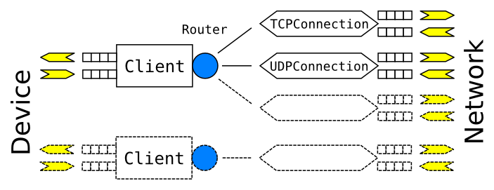

# Gnirehtet for developers

## Requirements

You need the [Android SDK] (_Android Studio_) and the JDK 8 (`openjdk-8-jdk`).

[Android SDK]: https://developer.android.com/studio/index.html

## Build

If `gradle` is installed on your computer:

    gradle build

Otherwise, you can call the [gradle wrapper]:

    ./gradlew build

You can also import the project in _Android Studio_: File → Import…

[gradle wrapper]: https://docs.gradle.org/current/userguide/gradle_wrapper.html

## Overview

The client registers itself as a [VPN], in order to intercept the whole device
network traffic.

It exchanges raw [IPv4 packets] as `byte[]` with the device:
 - it receives packets from the Android applications or system;
 - it must forge response packets.

The client (executed on the Android device) just maintains a TCP connection to
the relay server, and sends the raw packets to it.

This TCP connection is established over _adb_, after we started a reverse
port redirection:

    adb reverse tcp:31416 tcp:31416

This means that every connection initiated to `localhost:31416` from the device
will be redirected to the port `31416` on the computer, on which the relay
server is listening.

The relay server does all the hard work. It receives the IP packets from every
connected client and opens [standard sockets][berkeley] (which, of course, don't
require _root_) accordingly, then relays data in both directions. This requires
to translate packets between level 3 (on the device side) and level 5 (on the
network side) in the [OSI model].

In a sense, the relay server behaves like a [NAT] (more precisely a
[port-restricted cone NAT][portNAT]), in that it opens connections on behalf of
private peers. However, it differs from a standard NAT in the way it
communicates with the clients (the private peers), by using a very specific
(though simple) protocol, over a TCP connection.

[VPN]: https://developer.android.com/reference/android/net/VpnService.html
[IPv4 packets]: https://en.wikipedia.org/wiki/IPv4#Packet_structure
[OSI model]: https://en.wikipedia.org/wiki/OSI_model
[berkeley]: https://en.wikipedia.org/wiki/Berkeley_sockets
[NAT]: https://en.wikipedia.org/wiki/Network_address_translation
[portNAT]: https://en.wikipedia.org/wiki/Network_address_translation#Methods_of_translation

## Client

The client is an _Android_ project located in [`app/`](app/).

The [`VpnService`] is implemented by
[`GnirehtetService`].

We control the application through intents received by
[`GnirehtetControlService`] (these two services may not be merged, read
comments in [`GnirehtetControlService`]).

Some configuration options may be passed as extra parameters, converted to a
[`VpnConfiguration`] instance. Currently, the user can configure the DNS servers
to use.

The very first time, Android requests to the user the permission to enable the
VPN. In that case, the API requires to call
[`startActivityForResult`], so we need an [`Activity`]: this is the purpose
of [`AuthorizationActivity`].

[`RelayTunnel`] manages one connection to the relay server.
[`PersistentRelayTunnel`] manages [`RelayTunnel`] instances to handle
reconnections, so that we can stop and start the relay while the client keeps
running.

To send response packets to the system, we must write one packet at a time to
the VPN interface. Since we receive packets from the relay server over a TCP
connection, we have to split writes at packet boundaries: this is the purpose
of [`IPPacketOutputStream`].

[`VpnService`]: https://developer.android.com/reference/android/net/VpnService.html
[`GnirehtetService`]: app/src/main/java/com/genymobile/gnirehtet/GnirehtetService.java
[`GnirehtetControlService`]: app/src/main/java/com/genymobile/gnirehtet/GnirehtetControlService.java
[`VpnConfiguration`]: app/src/main/java/com/genymobile/gnirehtet/VpnConfiguration.java
[`startActivityForResult`]: https://developer.android.com/reference/android/app/Activity.html#startActivityForResult%28android.content.Intent,%20int%29
[`Activity`]: https://developer.android.com/reference/android/app/Activity.html
[`AuthorizationActivity`]: app/src/main/java/com/genymobile/gnirehtet/AuthorizationActivity.java
[`RelayTunnel`]: app/src/main/java/com/genymobile/gnirehtet/RelayTunnel.java
[`PersistentRelayTunnel`]: app/src/main/java/com/genymobile/gnirehtet/PersistentRelayTunnel.java
[`IPPacketOutputStream`]: app/src/main/java/com/genymobile/gnirehtet/IPPacketOutputStream.java

## Relay server

The relay server is a _Java 8_ project located in [`relay/`](relay/).

It is implemented using [asynchronous I/O] through [Java NIO]. As a
consequence, it is essentially monothreaded, so there is no need for
synchronization to handle packets.

Every [channel][SelectableChannel] (represented by yellow arrows on the schema
below) is registered to a unique [selector], defined in [`Relay`], with its
[`SelectionHandler`] as [attachment] (for better decoupling).

At the beginning, only the channel of the server socket, listening on port
31416, is registered. Then, a [`Client`] instance is created for every
accepted client.

[asynchronous I/O]: https://en.wikipedia.org/wiki/Asynchronous_I/O
[Java NIO]: https://en.wikipedia.org/wiki/New_I/O_%28Java%29
[SelectableChannel]: https://docs.oracle.com/javase/8/docs/api/java/nio/channels/SelectableChannel.html
[Selector]: https://docs.oracle.com/javase/8/docs/api/java/nio/channels/Selector.html
[`Relay`]: relay/src/main/java/com/genymobile/relay/Relay.java
[`SelectionHandler`]: relay/src/main/java/com/genymobile/relay/SelectionHandler.java
[attachment]: https://docs.oracle.com/javase/8/docs/api/java/nio/channels/SelectionKey.html#attachment--
[`Client`]: relay/src/main/java/com/genymobile/relay/Client.java

Each [`Client`] manages a TCP socket, used to transmit raw IP packets from and
to the _Gnirehtet_ Android client. Thus, these IP packets are encapsulated into
TCP (they are transmitted as the TCP payload).

When a client connects, the relay server assigns an integer id to it, which it
writes to the TCP socket. The client considers itself connected to the relay
server only once it has received this number. This allows to detect any
end-to-end connection issue immediately. For instance, a TCP _connect_ initiated
by a client succeeds whenever a port redirection is enabled (typically through
`adb reverse`), even if the relay server is not listening. In that case, the
first _read_ will fail.

The [`IPv4Packet`] class provides a structured view to read and write packet
data, which is physically stored in the buffers (the little squares on the
schema). Since we handle one packet at a time with asynchronous I/O, there is no
need to copy or synchronize access to the packets data: the [`IPv4Packet`]s
just point to the buffer where they are stored.

Each [`Client`] holds a [`Router`], responsible to send the packets to the
right [`Route`], identified by these 4 properties available in the IP and
transport headers:

 - source address
 - source port
 - destination address
 - destination port

The [`Route`] creates a [`Connection`] ([`TCPConnection`] or [`UDPConnection`])
to the requested destination, and registers its channel to the selector.

The connection is responsible for converting data from level 3 to level 5 for
device-to-network packets, and from level 5 to level 3 for network-to-device
packets. For [UDP][`UDPConnection`], it consists essentially in removing or
adding IP and transport headers. For [TCP][`TCPConnection`], however, it
requires to respond to the client according to the TCP protocol ([RFC 793]),
in such a way as to ensure a correct end-to-end communication.

The class [`Packetizer`] converts from level 5 to level 3 by appending correct
IP and transport headers.

[`IPv4Packet`]: relay/src/main/java/com/genymobile/relay/IPv4Packet.java
[`Router`]: relay/src/main/java/com/genymobile/relay/Router.java
[`Route`]: relay/src/main/java/com/genymobile/relay/Route.java
[`Connection`]: relay/src/main/java/com/genymobile/relay/Connection.java
[`TCPConnection`]: relay/src/main/java/com/genymobile/relay/TCPConnection.java
[`UDPConnection`]: relay/src/main/java/com/genymobile/relay/UDPConnection.java
[RFC 793]: https://tools.ietf.org/html/rfc793
[`Packetizer`]: relay/src/main/java/com/genymobile/relay/Packetizer.java

### UDP connection

When the first packet for a specific UDP connection is received from the device,
a new [`UDPConnection`] is created. It keeps a copy of the IP and UDP headers
of this first packet, switching the source and the destination, in order to use
them as headers for all response packets.

The relaying is simple for UDP: each packet received from one side must be sent
to the other side, without any splitting or merging (datagram boundaries must be
preserved for UDP).

Since UDP is not a connected protocol, [`SelectorAlarm`] wake up the selector
once per minute to clean expired (in practice, unused for more than 2 minutes)
UDP connections.

[`DatagramChannel`]: relay/src/main/java/com/genymobile/relay/DatagramChannel.java
[`SelectorAlarm`]: relay/src/main/java/com/genymobile/relay/SelectorAlarm.java

### TCP connection

[`TCPConnection`] also keeps, as a reference, a copy of the IP and TCP headers
of the first packet received.

However, contrary to UDP, TCP must provide reliable delivery. In particular,
lost packets have to be retransmitted. Nonetheless, we can take advantage of the
two TCP we are proxifying, so that we can provide reliability by delegating the
retransmission mechanism to them. In fact, it is sufficient to guarantee that
**we cannot lose packets from network to device**.

Indeed, any packet written to a TCP channel is safe, since it will be managed by
the TCP implementation from the system. Losing a raw IP packet received from the
device is also safe: the device TCP implementation will follow the TCP protocol
to retransmit it. Therefore, **dropping packets from device to network does not
break the connection**.

On the other hand, once we retrieved a packet from a TCP channel from the
network, we are responsible for it. Would it be dropped, there would be no way
to recover the connection.

As far as I know, there are only two possible causes of packet loss for which we
are responsible:

 1. When **our buffers are full**, we won't resize them indefinitely, so we have to
drop packets. Typically, this may happen if the data from the network is
received at a higher rate than that they can be sent to the device.

 2. When **a raw packet is considered invalid** by the device, it is rejected.
This may happen for example if the checksum is invalid or if the TCP sequence
number is [out-of-the-window][flow control].

[flow control]: https://en.wikipedia.org/wiki/Transmission_Control_Protocol#Flow_control

Therefore, by [contraposition], if we guarantee that we never retrieve a packet
that we won't be able to store, and that we provide a valid checksum and respect
the client TCP window, then **we won't lose any packet without implementing any
retransmission mechanism**.

[contraposition]: https://en.wikipedia.org/wiki/Contraposition

To prevent retrieving a packet while our buffers are full, we indicate that we
are not [interested in reading][interestOps] the TCP channel when some pending
data remain to be written to the client buffer. Once some space becomes
available, the client then _pulls_ the available packets from the
[`TCPConnection`]s (that implements [`PacketSource`]).

[interestOps]: https://developer.android.com/reference/java/nio/channels/SelectionKey.html#interestOps%28int%29
[`PacketSource`]: relay/src/main/java/com/genymobile/relay/PacketSource.java

## Hack

For more details, go read the code!

If you find a bug, or have an awesome idea to implement, please discuss and
contribute ;-)
