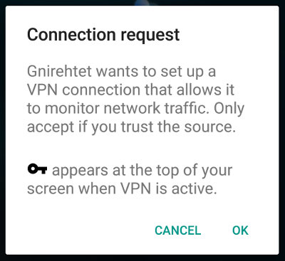

# Gnirehtet

This project provides **reverse tethering** over `adb` for Android: it
allows devices to use the internet connection of the computer they are plugged
on. It does not require any _root_ access (neither on the device nor on the
computer). It works on _GNU/Linux_, _Windows_ and _Mac OS_.

Currently, it relays [TCP] and [UDP] over [IPv4] traffic, but it does not
support [IPv6] (yet?).

[TCP]: https://en.wikipedia.org/wiki/Transmission_Control_Protocol
[UDP]: https://fr.wikipedia.org/wiki/User_Datagram_Protocol
[IPv4]: https://en.wikipedia.org/wiki/IPv4
[IPv6]: https://en.wikipedia.org/wiki/IPv6

## Flavors

Two implementations of _Gnirehtet_ are available:
 - one in **Java**;
 - one in **Rust**.

### Which one to choose?

Use the **Rust** implementation. The native binary consumes less CPU and memory,
and does not require a _Java_ runtime environment.

The relay server of _Gnirehtet_ was initially only implemented in Java. As a
benefit, the same "binary" runs on every platform having _Java 8_ runtime
installed. It is still maintained to provide a working alternative in case of
problems with the Rust version.

## Requirements

The Android application requires at least API 21 (Android 5.0).

For the _Java_ version only, _Java 8_ (JRE) is required on your computer. On
Debian-based distros, install the package `openjdk-8-jre`.

### adb

You need a recent version of [adb] (where `adb reverse` is implemented, it
works with 1.0.36).

It is available in the [Android SDK platform tools][platform-tools].

On Debian-based distros, you can alternatively install the package
`android-tools-adb`.

On Windows, if you need `adb` only for this application, just download the
[platform-tools][platform-tools-windows] and extract the following files to the
_gnirehtet_ directory:
 - `adb.exe`
 - `AdbWinApi.dll`
 - `AdbWinUsbApi.dll`

Make sure you [enabled adb debugging][enable-adb] on your device(s).

[adb]: https://developer.android.com/studio/command-line/adb.html
[enable-adb]: https://developer.android.com/studio/command-line/adb.html#Enabling
[platform-tools]: https://developer.android.com/studio/releases/platform-tools.html
[platform-tools-windows]: https://dl.google.com/android/repository/platform-tools-latest-windows.zip

## Download

Download the [latest release][latest] in the flavor you want.

[latest]: https://github.com/Genymobile/gnirehtet/releases/latest

### Rust

 - **Linux:** [`gnirehtet-rust-linux64-v2.1.zip`][direct-rust-linux64]  
   (SHA-256: _0f2a694611270eaf8a18af9ebf713932e05e4be75d0a38774154804da4d60d4d_)
 - **Windows:** [`gnirehtet-rust-win64-v2.1.zip`][direct-rust-win64]  
   (SHA-256: _c0e35317d99a5ce6c9e7f656074f2793770082d89e0851830daa9ee6434d488d_)
 - **MacOS:** [`gnirehtet-rust-macos64-v2.1.zip`][direct-rust-macos64]  
   (SHA-256: _0109968f6189f0a55674a67095c4cfad35639d13587ecd0a23d88a47135217d0_)

[direct-rust-linux64]: https://github.com/Genymobile/gnirehtet/releases/download/v2.1/gnirehtet-rust-linux64-v2.1.zip
[direct-rust-win64]: https://github.com/Genymobile/gnirehtet/releases/download/v2.1/gnirehtet-rust-win64-v2.1.zip
[direct-rust-macos64]: https://github.com/Genymobile/gnirehtet/releases/download/v2.1/gnirehtet-rust-macos64-v2.1.zip

Then extract it.

The Linux and MacOS archives contain:
 - `gnirehtet.apk`
 - `gnirehtet`

The Windows archive contains:
 - `gnirehtet.apk`
 - `gnirehtet.exe`
 - `gnirehtet-run.cmd`

### Java

 - **All platforms:** [`gnirehtet-java-v2.1.zip`][direct-java]  
   (SHA-256: _c8e8a1297264e0927fba8675147ad710feadfbcf3bb37463e8a5783fa9d77909_)

[direct-java]: https://github.com/Genymobile/gnirehtet/releases/download/v2.1/gnirehtet-java-v2.1.zip

Then extract it. The archive contains:
 - `gnirehtet.apk`
 - `gnirehtet.jar`
 - `gnirehtet`
 - `gnirehtet.cmd`
 - `gnirehtet-run.cmd`

## Run (simple)

_Note: On Windows, replace `./gnirehtet` by `gnirehtet` in the following
commands._

The application has no UI, and is intended to be controlled from the computer
only.

If you want to activate reverse tethering for exactly one device, just execute:

    ./gnirehtet run

Reverse tethering remains active until you press _Ctrl+C_.

On Windows, for convenience, you can double-click on `gnirehtet-run.cmd`
instead (it just executes `gnirehtet run`, without requiring to open a
terminal).

The very first start should open a popup to request permission:

A "key" logo appears in the status bar whenever _Gnirehtet_ is active:

## Run

You can execute the actions separately (it may be useful if you want to reverse
tether several devices simultaneously).

Start the relay server and keep it open:

    ./gnirehtet relay

Install the `apk` on your Android device:

    ./gnirehtet install [serial]

_(if an older version of _gnirehtet_ was already installed, you must install the
new one first)_

In another terminal, for each client, execute:

    ./gnirehtet start [serial]

To stop a client:

    ./gnirehtet stop [serial]

The _serial_ parameter is required only if `adb devices` outputs more than one
device.

For advanced options, call `./gnirehtet` without arguments to get more details.

## Run manually

The `gnirehtet` program exposes a simple command-line interface that executes
lower-level commands. You can call them manually instead.

To start the relay server:

    java -jar gnirehtet.jar relay

To install the apk:

    adb install -r gnirehtet.apk

To start a client:

    adb reverse localabstract:gnirehtet tcp:31416
    adb shell am broadcast -a com.genymobile.gnirehtet.START \
        -n com.genymobile.gnirehtet/.GnirehtetControlReceiver

To stop a client:

    adb shell am broadcast -a com.genymobile.gnirehtet.STOP \
        -n com.genymobile.gnirehtet/.GnirehtetControlReceiver

## Why _gnirehtet_?

    rev <<< tethering

(in _Bash_)

## Developers

Read the [developers page].

[developers page]: DEVELOP.md

## Licence

    Copyright (C) 2017 Genymobile

    Licensed under the Apache License, Version 2.0 (the "License");
    you may not use this file except in compliance with the License.
    You may obtain a copy of the License at

        http://www.apache.org/licenses/LICENSE-2.0

    Unless required by applicable law or agreed to in writing, software
    distributed under the License is distributed on an "AS IS" BASIS,
    WITHOUT WARRANTIES OR CONDITIONS OF ANY KIND, either express or implied.
    See the License for the specific language governing permissions and
    limitations under the License.

## Articles

- [Introducing “gnirehtet”, a reverse tethering tool for Android][medium-1] ([French version][blog-1])
- [Gnirehtet 2: our reverse tethering tool for Android now available in Rust][medium-2]
- [Gnirehtet rewritten in Rust][blog-2-en] ([French version][blog-2-fr])

[medium-1]: https://medium.com/@rom1v/gnirehtet-reverse-tethering-android-2afacdbdaec7
[blog-1]: https://blog.rom1v.com/2017/03/gnirehtet/
[medium-2]: https://medium.com/genymobile/gnirehtet-2-our-reverse-tethering-tool-for-android-now-available-in-rust-999960483d5a
[blog-2-en]: https://blog.rom1v.com/2017/09/gnirehtet-rewritten-in-rust/
[blog-2-fr]: https://blog.rom1v.com/2017/09/gnirehtet-reecrit-en-rust/
